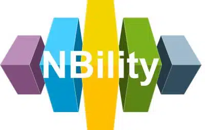

# NBility Model

Welcome to the documentation of the NBility Model.

## Introduction

NBility is a capability model for a grid operator. It has been created to simplify working together within the utility sector and with the suppliers/advisors of the grid operators. The NBilty model exists of a capability model, a related business object model and a value stream model.

The NBility model is maintained by the Dutch Distribution System Operators. A User Group, where users of NBility can exchange experiences and make suggestions for improvement, is being established.

## Navigating the documentation

Use the navigation menu in the left sidebar to access the pages in the documentation.

## Other resources

- [Explanation of the NBility model at EDSN](https://www.edsn.nl/nbility-model/)
