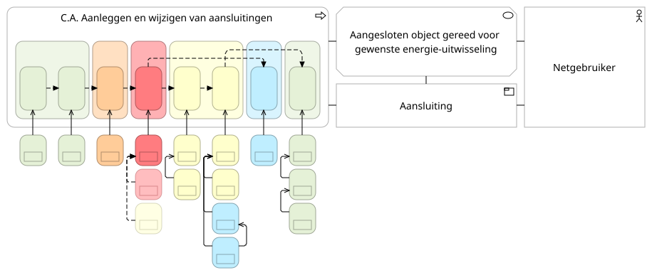

# Legenda

In de diagrammen van NBility brengen we de werking van de netbeheerder in kaart. Dit doen we met drie samenhangende elementen: **capabilities**, **objecten** en **waardestromen**.

De gouden regel van ons model is simpel:

> Een capability is het vermogen om een object in een gewenste toestand te brengen binnen een waardestroom.

Dit leggen we hieronder uit aan de hand van de waardestroom [C.A. Aanleggen en wijzigen van aansluitingen](https://nbility.netbeheernederland.nl/model/?view=id-caad12a9fb99480c8037d509a0dbe0c2). We beginnen bij wat een waardestroomdiagram laat zien.

## Waar kijk je naar?

Een waardestroomdiagram laat zien hoe we waarde leveren aan een stakeholder.

Rechtsboven zie je het resultaat: een product (`Aansluiting`) voor een specifieke stakeholder (`Netgebruiker`) die daar waarde aan ontleent (`Aangesloten object gereed voor gewenste energie-uitwisseling`). Van daaruit lees je het diagram van rechts naar links en van boven naar beneden:

- **Van rechts naar links** zie je welke fasen nodig zijn om deze waarde te realiseren.
- **Van boven naar beneden** zie je hoe deze fasen worden uitgevoerd: door capabilities die objecten in de juiste toestand brengen.

Het diagram laat daarmee niet alleen zien *wat we doen*, maar ook *waarom dit zo samenhangt*. De onderstaande uitleg maakt dit verder inzichtelijk.

## De lagen in het diagram

### De bovenste rij: waardestroomfasen

De waardestroom laat zien welke opeenvolgende fasen we doorlopen om waarde te leveren aan onze stakeholders.

- **Hoe herken je dit?** Als de bovenste rij afgeronde rechthoeken (zoals `C.A.3.1. Inpassen aansluiting in energienet`). De figuur hieronder toont drie fasen uit het midden van de waardestroom.

  

- **De gestreepte pijlen:** Gestreepte pijlen verbinden deze fasen. Omdat waardestromen in de praktijk kunnen splitsen en samenvoegen, zie je gestreepte pijlen soms over fasen heen springen. Deze pijlen geven geen strikte tijdsvolgorde aan maar beïnvloeding: de objectstatus bereikt in de vorige fase beïnvloedt het verloop van de volgende. In de praktijk kan een proces fasen overslaan of juist terugkeren naar een eerdere fase in de waardestroom.

### De middelste rij: capabilities met geneste objecten

Een capability beschrijft een specifieke vaardigheid of capaciteit die we als netbeheerder stabiel in huis moeten hebben. Het gaat over *wat* we kunnen, onafhankelijk van hoe we het vandaag de dag via specifieke processen of systemen hebben georganiseerd.

- **Hoe herken je dit?** Als de afgeronde rechthoeken direct onder de waardestroomfasen.

Binnen een fase werken capabilities vaak samen:

- **De leidende capability:** De bovenste capability direct onder de fase trekt de activiteit (zoals `C.5.3. Werkzaamheden uitvoeren` direct onder `C.A.4.2. Uitvoeren aansluitwerkzaamheden`).

  

- **De faciliterende capabilities:** De leidende capability wordt geholpen door de faciliterende capabilities daaronder (zoals `C.5.4. Werkzaamheden faciliteren`).

  

#### Hoe faciliteren capabilities elkaar?

Een faciliterende capability zorgt ervoor dat de leidende capability haar werk kan doen. Dit gebeurt op twee manieren:

1. **Met gelijktijdige activiteit:** Beide capabilities zijn binnen dezelfde fase actief om de toestand van hun objecten te wijzigen. Dit herken je aan de doorlopende pijl
   * *Voorbeeld:* De capability die werkzaamheden uitvoert (`C.5.3`) vraagt een andere capability om werkmiddelen beschikbaar te stellen (`C.5.4`).
2. **Zonder gelijktijdige activiteit:** De faciliterende capability levert vooraf een object in de gewenste toestand aan, zonder dat ze zelf actief hoeft te zijn tijdens de fase. Deze herken je aan de gestreepte pijl, geaccentueerd met halfdoorzichtigheid.
   * *Voorbeeld:* De netstrategie en netrichtlijnen (`C.3.3`) moeten vooraf zijn vastgesteld, zodat je nu een aansluiting passend kunt ontwerpen in het energienet (`C.3.1`). De strategie-capability is niet actief tijdens het ontwerpen zelf.

#### Waardeobjecten (ingesloten door de capabilities)

Een waardeobject (of bedrijfsobject) is een fysieke of logische entiteit (zoals een *Klant*, *Aansluiting*, *Energienet* of *Werkopdracht*) die in een door de stakeholder gewenste toestand waarde vertegenwoordigt.

- **Hoe herken je dit?** Als de binnenste rechthoeken die binnenin de capabilities getekend zijn.
- **De betekenis van insluiting:** Dat een object binnen een capability is getekend, betekent dat die capability het vermogen heeft om dit specifieke object in de gewenste toestand te brengen.

### De onderste rij: het gespiegelde objectenmodel

Helemaal onderaan het diagram zie je het gespiegelde objectenmodel. Dit toont alle objecten uit de waardestroom nogmaals, maar dan los van de capabilities en direct met elkaar verbonden via afhankelijkheidsrelaties.

- **Hoe lees je dit?** Waar een waardestroom zich vooruit beweegt in de tijd (bijvoorbeeld van een `Werkopdracht` naar een `Werkactiviteit`), wijzen de afhankelijkheden tussen de objecten juist terug in de tijd (een `Werkactiviteit` is *geautoriseerd door* een `Werkopdracht`).
- **Waarom is dit belangrijk?** Dit netwerk toont de afhankelijkheden. Het feit dat een `Werkactiviteit` gebaseerd is op een bepaalde `Werkopdracht` is bepalend voor die werkactiviteit. Deze afhankelijkheden verklaren waarom de fasen in deze volgorde plaatsvinden.

## Kleur in de diagrammen

### Wat betekenen de kleuren?

Kleur helpt je om direct te zien in welk domein een element thuishoort (bijv. `Klant` is groen, `Energietransport` is blauw, `Energienet` is rood, `Meting` is paars, `Werk` is geel en `Energiemarkt` is oranje).

- **De capability bepaalt de kleur:** Op het hoogste niveau ([niveau 0](https://nbility.netbeheernederland.nl/model/?view=id-25906f8d7f874fbca0a1d147d9731652)) zijn alle elementen wit. Vanaf [niveau 1](https://nbility.netbeheernederland.nl/model/?view=id-48651592d60f4f83987a94da73f614f3) hebben capabilities een vaste kleur. Zowel de fasen daarboven als de objecten daarbinnen nemen deze kleur over van de bijbehorende capability. (Fase `C.A.3.1` is rood omdat de leidende capability `C.3.1` rood is).
