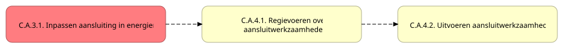
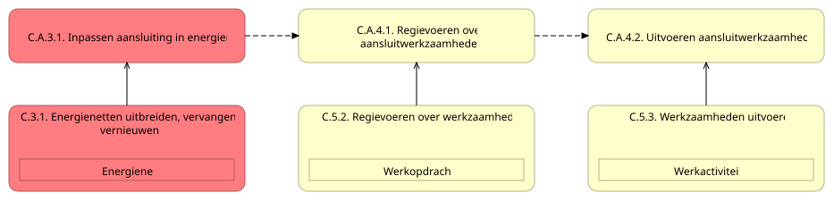
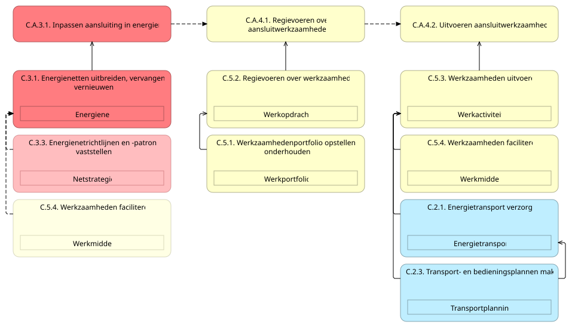
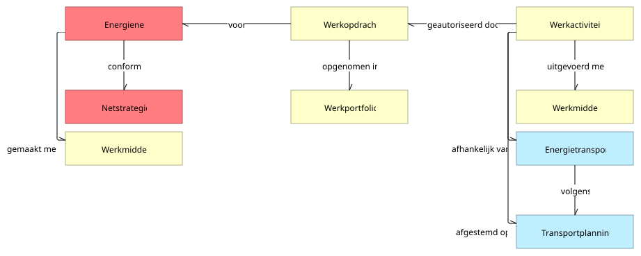

# Legenda

In de diagrammen van NBility brengen we de werking van de netbeheerder in kaart. We doen dit door drie elementen nauw met elkaar te verweven: **capabilities**, **objecten** en **waardestromen**.

De gouden regel van ons model is simpel:

> Een capability is het vermogen om een object in een gewenste toestand te brengen voor een bepaalde waardestroom.

In de waardestroomdiagrammen herken je deze elementen aan hun gelaagde opbouw onder elkaar. Hieronder leggen we uit hoe je deze lagen en hun onderlinge afhankelijkheden leest.

## De lagen in het diagram

De voorbeelden zijn gebaseerd op de waardestroom [C.A. Aanleggen en wijzigen van aansluitingen](https://nbility.netbeheernederland.nl/model/?view=id-caad12a9fb99480c8037d509a0dbe0c2) op beschouwingsniveau 2.

### De bovenste rij: waardestroomfasen

De waardestroom laat zien welke opeenvolgende fasen we doorlopen om waarde te leveren aan onze stakeholders.

* **Hoe herken je dit?** Als de bovenste rij afgeronde rechthoeken (zoals `C.A.3.1. Inpassen aansluiting in energienet`).

  

* **De gestreepte pijlen:** Gestreepte pijlen verbinden deze fasen. Omdat waardestromen in de praktijk kunnen splitsen en samenvoegen, zie je gestreepte pijlen soms over fasen heen springen. Deze pijlen geven geen tijdsvolgorde aan maar beïnvloeding: de objectstatus bereikt in de vorige fase beïnvloedt het verloop van de volgende. In de praktijk kan een feitelijk proces fasen overslaan of juist terugkeren naar een eerdere fase in de waardestroom.

### De middelste rij: capabilities met geneste objecten

Een capability beschrijft een specifieke vaardigheid of capaciteit die we als netbeheerder stabiel in huis moeten hebben. Het gaat over *wat* we kunnen, onafhankelijk van hoe we het vandaag de dag via specifieke processen of systemen hebben georganiseerd.

* **Hoe herken je dit?** Als de afgeronde rechthoeken direct onder de waardestroomfasen.

Binnen een fase werken capabilities vaak samen:

* **De leidende capability:** De bovenste capability direct onder de fase trekt de activiteit (zoals `C.5.3. Werkzaamheden uitvoeren`).

  

* **De faciliterende capabilities:** De leidende capability wordt geholpen door de faciliterende capabilities daaronder (zoals `C.5.4. Werkzaamheden faciliteren`).

  

#### Hoe faciliteren capabilities elkaar?

Een faciliterende capability zorgt ervoor dat de leidende capability haar werk kan doen. Dit gebeurt op twee manieren:

1. **Met gelijktijdige activiteit:** Beide capabilities zijn binnen dezelfde fase actief om de toestand van hun objecten te wijzigen. Dit herken je aan de doorlopende pijl
   * *Voorbeeld:* De capability die werzaamheden uitvoert (`C.5.3`) vraagt een andere capability om werkmiddelen beschikbaar te stellen (`C.5.4`).
2. **Zonder gelijktijdige activiteit:** De faciliterende capability levert vooraf een object in de gewenste toestand aan, zonder dat ze zelf actief hoeft te zijn tijdens de fase. Deze herken je aan de gestreepte pijl, geaccentueerd met halfdoorzichtigheid.
   * *Voorbeeld:* De netstrategie en netrichtlijnen (`C.3.3`) moeten vooraf zijn vastgesteld, zodat je nu een aansluiting passend kunt ontwerpen in het energienet (`C.3.1`). De strategie-capability is niet actief tijdens het ontwerpen zelf.

#### Waardeobjecten (ingesloten door de capabilities)

Een waardeobject (of bedrijfsobject of simpelweg object) is een fysieke of logische entiteit (zoals een *Klant*, *Aansluiting*, *Energienet* of *Werkopdracht*) die in een door de stakeholder gewenste toestand waarde vertegenwoordigt.

* **Hoe herken je dit?** Als de binnenste rechthoeken die binnenin de capabilities getekend zijn.
* **De betekenis van insluiting:** Dat een object binnen een capability is getekend, betekent dat die capability het vermogen heeft om dit specifieke object in de gewenste toestand te brengen.

### De onderste rij: het gespiegelde objectmodel

Helemaal onderaan het diagram zie je het gespiegelde objectmodel. Dit toont alle objecten uit de waardestroom nogmaals, maar dan los van de capabilities en direct met elkaar verbonden via afhankelijkheidsrelaties.

* **Hoe lees je dit?** Waar een waardestroom zich vooruit beweegt in de tijd (bijvoorbeeld van een `Werkopdracht` naar een `Werkactiviteit`), wijzen de afhankelijkheden tussen de objecten juist terug in de tijd (een `Werkactiviteit` is *geautoriseerd door* een `Werkopdracht`).
* **Waarom is dit belangrijk?** Dit netwerk toont de waarderelevante afhankelijkheden. Het feit dat een `Aansluiting` gebaseerd is op een bepaalde `Klantovereenkomst` is bepalend voor die aansluiting (je kunt deze aansluiting immers alleen realiseren onder de voorwaarden die in de overeenkomst zijn afgesproken). Deze logische wetmatigheid verklaart *waarom* de fasen in deze specifieke volgorde moeten plaatsvinden.

## Kleur in de diagrammen

### Wat betekenen de kleuren?

Kleur helpt je om direct te zien in welk domein een element thuishoort (bijv. `Klant` is groen, `Energietransport` is blauw, `Energienet` is rood, `Meting` is paars, `Werk` is geel en `Energiemarkt` is oranje).

* **De capability bepaalt de kleur:** Op het hoogste niveau ([niveau 0](https://nbility.netbeheernederland.nl/model/?view=id-25906f8d7f874fbca0a1d147d9731652)) zijn alle elementen wit. Vanaf [niveau 1](https://nbility.netbeheernederland.nl/model/?view=id-48651592d60f4f83987a94da73f614f3) hebben capabilities een vaste kleur. Zowel de fasen daarboven als de objecten daarbinnen erven deze kleur over van de bijbehorende capability. (Fase `C.A.3.1` is rood omdat de leidende capability `C.3.1` rood is).

## De logica achter het model

Achter deze visuele spelregels schuilt een exact raamwerk. Benieuwd naar de theorie, de formele regels of de automatische validator?

[Ontdek het metamodel achter NBility &rarr;](metamodel)
